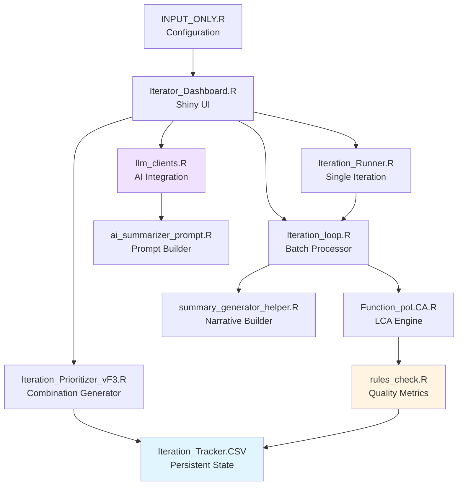

# Iterator-v2: Latent Class Analysis Iteration System

**Version:** 2.0  
**Author:** Gurujeet Shetty  
**Purpose:** Automated iterative latent class analysis (LCA) for market segmentation

---

## 📋 Table of Contents

- [Overview](#overview)
- [Installation](#installation)
- [Quick Start](#quick-start)
- [Excel Input Format](#excel-input-format)
- [Configuration](#configuration)
- [Dashboard Guide](#dashboard-guide)
- [Metrics Reference](#metrics-reference)
- [Custom OF_ Metrics](#custom-of_-metrics)
- [LLM Integration](#llm-integration)
- [Architecture](#architecture)
- [Troubleshooting](#troubleshooting)

---

## Overview

**Iterator** is an R-based application that automates the process of evaluating different variable combinations for latent class analysis (LCA) segmentation. Instead of manually testing which variables produce good segments, Iterator:

1. **Generates** variable combinations based on theme-aware constraints
2. **Runs** poLCA (Latent Class Analysis) on each combination
3. **Evaluates** segmentation quality using 50+ custom metrics
4. **Tracks** all iterations in a persistent CSV database
5. **Summarizes** results using AI-powered narrative generation

**Use Cases:**
- Market segmentation research
- Customer typology development
- Psychographic profiling
- Behavioral clustering

---

## Installation

### Prerequisites

- **R Version:** 4.0.0 or higher
- **RStudio:** Recommended (optional)

### Required R Packages

```r
install.packages(c(
  "shiny", "shinydashboard", "shinyjs", "shinyWidgets",
  "dplyr", "tibble", "tidyr", "purrr",
  "readxl", "openxlsx",
  "poLCA", "weights",
  "httr", "jsonlite", "stringr"
))
```

### Installation Steps

1. **Clone or download** the Iterator-v2 directory
2. **Edit** `INPUT_ONLY.R` to set your working directory:
   ```r
   iterator_home <- "/Users/yourname/Iterator-v2"
   ```
3. **Launch** the dashboard:
   ```r
   setwd("/Users/yourname/Iterator-v2")
   source("INPUT_ONLY.R")
   ```

---

## Quick Start

### 1. Prepare Your Excel File

Create an `INPUT.xlsx` file with the following sheets:

- **THEMES**: Define variable themes with min/max constraints
- **INPUT**: Your survey/research data (respondent-level)
- **VARIABLES**: Variable scores for prioritization
- *Optional: **FA_OP***: Factor analysis loadings
- *Optional: **RAW_DATA***: Raw data for correlation metrics

### 2. Launch the Dashboard

```r
source("INPUT_ONLY.R")
```

### 3. Generate Combinations

1. Go to **"Input Generator"** tab
2. Load your `INPUT.xlsx` file
3. Set constraints (min/max variables, mandatory variables)
4. Click **"Generate Best Combinations"**
5. Export to tracker CSV

### 4. Run Iterations

Go to **"History Generator"** tab and click **"Run Pending Iterations"**

### 5. View Results

Navigate to **"Results Explorer"** tab to filter/sort iterations by metrics

---

## Excel Input Format

### THEMES Sheet

Defines variable groupings with min/max constraints per theme.

**Format:**
| Theme | Min | Max |
|-------|-----|-----|
| Brand Perception | 2 | 4 |
| Usage Behavior | 1 | 3 |
| Demographics | 0 | 2 |

### INPUT Sheet

Contains respondent-level data with 6 metadata rows:

**Row 1:** Variable IDs (e.g., `Q1_BRAND_TRUST`, `Q2_USAGE_FREQ`)  
**Row 2:** Theme assignment (e.g., `Brand Perception`, `Usage Behavior`)  
**Row 3:** Answer description (e.g., `Trust in brand X`)  
**Row 4:** Variable type (`RATING7`, `RATING5`, `SINGLESELECT`, `MULTISELECT`, `NUMERIC`)  
**Row 5:** Question prefix (question text)  
**Row 6:** Input flag (`Y`/`N` or `1`/`0` - marks eligible variables for LCA)  
**Row 7+:** Respondent data

### VARIABLES Sheet

Assigns scores to variables for prioritization.

**Format (starting at B2):**
| Variable | Score |
|----------|-------|
| Q1_BRAND_TRUST | 85 |
| Q2_USAGE_FREQ | 92 |

### FA_OP Sheet (Optional)

Factor analysis results for calculating FA_* metrics.

**Format:**
| Variable | Factor1 | Factor2 | Factor3 | Communality |
|----------|---------|---------|---------|-------------|
| Q1 | 0.82 | 0.12 | -0.05 | 0.69 |

### RAW_DATA Sheet (Optional)

Raw numeric data for Pearson correlation metrics.

**Format:**
| respondent_id | var1 | var2 | var3 |
|---------------|------|------|------|
| 1 | 5 | 3 | 7 |

---

## Configuration

All configuration is in `INPUT_ONLY.R`:

```r
iterator_config <- list(
  # Paths
  iterator_home = "/Users/yourname/Iterator",
  input_directory = "/Users/yourname/Iterator/input",
  output_directory = "/Users/yourname/Iterator/output",
  
  # Iteration defaults
  min_n_size = 8L,        # Minimum variables per combination
  max_n_size = 10L,       # Maximum variables per combination
  max_iterations = 100L,  # Max combinations to generate
  mandatory_vars = "5,7", # Column indices that must be included
  
  # Quality thresholds
  bimodality_hi_threshold = 110,
  bimodality_low_threshold = 0.2,
  performance_hi_threshold = 120,
  performance_lo_threshold = 80,
  
  # LLM API keys
  ai_provider = "openai",  # openai | groq | gemini
  ai_model = "gpt-4o-mini",
  openai_api_key = "sk-...",  # Your API key
  
  # Shiny server
  shiny_host = "0.0.0.0",
  shiny_port = 8080L
)
```

---

## Dashboard Guide

### 1. Input Generator

**Purpose:** Generate variable combinations

**Steps:**
1. Load INPUT.xlsx
2. Set min/max n_size
3. Specify mandatory variables
4. Set max iterations
5. Generate combinations
6. Export to tracker CSV

### 2. Iteration Runner

**Purpose:** Run a single custom iteration

**Steps:**
1. Select variables manually
2. Set number of segments
3. Click "Run Iteration"
4. View results in modal

### 3. History Generator

**Purpose:** Batch process all pending iterations

**Steps:**
1. Load tracker CSV
2. Review pending iterations
3. Click "Run Pending Iterations"
4. Monitor progress bar
5. View completed status

### 4. Results Explorer

**Purpose:** Filter, sort, and analyze iteration results

**Features:**
- Filter by metric ranges (e.g., `PROB_95 > 0.8`)
- Sort by any metric
- Download filtered results
- View detailed iteration summaries

### 5. AI Summarizer

**Purpose:** Generate AI-powered narrative for a single solution

**Steps:**
1. Select completed iteration
2. Optionally provide context prompt
3. Click "Generate Summary"
4. View coherence score and narrative

### 6. Bulk LLM Summarizer

**Purpose:** Compare multiple solutions using AI

**Steps:**
1. Select multiple iterations
2. Provide comparison prompt
3. Generate bulk summaries
4. Review clarity scores and issues

---

## Metrics Reference

Iterator calculates **50+ metrics** per iteration. See [METRICS.md](METRICS.md) for complete reference.

### Key Metric Categories

**Quality Metrics:**
- `PROB_95`, `PROB_90`, `PROB_80`, `PROB_75`: % of respondents with probability > threshold
- `PROB_LESS_THAN_50`: % with low assignment confidence

**Segmentation Metrics:**
- `MAX_N_SIZE`, `MIN_N_SIZE`: Largest/smallest segment sizes
- `BIMODAL_VARS`: Count of variables with bimodal distribution
- `PROPER_BUCKETED_VARS`: Variables with clean top/bottom separation

**Differentiation Metrics:**
- `bi_1` through `bi_5`: Bimodal variables per segment
- `perf_1` through `perf_5`: Performance-differentiating variables
- `indT_1` through `indT_5`: Top-box independent variables
- `indB_1` through `indB_5`: Bottom-box independent variables

**Custom Metrics:**
- `OF_*_VALUES`: Custom objective function values
- `OF_*_MAXDIFF`: Maximum difference between segments
- `OF_*_MINDIFF`: Minimum difference between segments

---

## Custom OF_ Metrics

### What are OF_ Metrics?

**OF_** (Objective Function) metrics are **custom KPIs** you define in your Excel output. They allow you to track business-specific metrics across segments.

### How to Define OF_ Metrics

1. **In your summary Excel** (generated by poLCA), add a table with format:

```
OF_BRAND_PREFERENCE
Segment1  Segment2  Segment3  Segment4
   85        72        91        78
   82        75        88        80
```

2. **Naming Rules:**
   - Must start with `OF_`
   - Use only alphanumeric and underscores
   - Examples: `OF_BRAND_PREFERENCE`, `OF_NPS_SCORE`, `OF_PURCHASE_INTENT`

3. **Table Structure:**
   - Row 1: Metric name (e.g., `OF_BRAND_PREFERENCE`)
   - Subsequent rows: Numeric data with one column per segment

### Output

Iterator automatically creates three columns per OF_ metric:

- `OF_BRAND_PREFERENCE_VALUES`: Mean values per segment (e.g., "85 | 72 | 91 | 78")
- `OF_BRAND_PREFERENCE_MAXDIFF`: Max difference between segments (e.g., 19)
- `OF_BRAND_PREFERENCE_MINDIFF`: Min difference between segments (e.g., 3)

---

## LLM Integration

Iterator supports three LLM providers for AI summarization:

### OpenAI

```r
iterator_config$ai_provider <- "openai"
iterator_config$ai_model <- "gpt-4o-mini"  # or gpt-4, gpt-3.5-turbo
iterator_config$openai_api_key <- "sk-..."
```

### Groq

```r
iterator_config$ai_provider <- "groq"
iterator_config$ai_model <- "llama-3.1-70b-versatile"
iterator_config$groq_api_key <- "gsk_..."
```

### Gemini

```r
iterator_config$ai_provider <- "gemini"
iterator_config$ai_model <- "gemini-1.5-pro"
iterator_config$gemini_api_key <- "..."
```

---

## Architecture



### Component Overview

| Component | Purpose |
|-----------|---------|
| `INPUT_ONLY.R` | Central configuration hub |
| `Iterator_Dashboard.R` | Shiny UI with 6 tabs |
| `Iteration_Prioritizer_vF3.R` | Theme-aware combination generator |
| `Iteration_Runner.R` | Single iteration execution |
| `Iteration_loop.R` | Batch iteration processor with caching |
| `Function_poLCA.R` | poLCA wrapper for LCA |
| `rules_check.R` | 50+ quality metric calculations |
| `summary_generator_helper.R` | Text narrative generation |
| `llm_clients.R` | Multi-provider LLM client |

---

## Troubleshooting

### Issue: OF_ metrics not appearing

**Solution:**
1. Check console for `[OF_METRICS]` debug messages
2. Verify OF_ table format in Excel (name in first cell, numeric data below)
3. Ensure metric name starts with `OF_`
4. Check Results Explorer for columns like `OF_XXX_VALUES`

### Issue: Dashboard won't launch

**Solution:**
1. Check R version >= 4.0
2. Install missing packages
3. Verify `iterator_home` path in `INPUT_ONLY.R`
4. Check console for error messages

### Issue: poLCA fails to converge

**Solution:**
1. Increase `set_maxiter` (default: 1000)
2. Increase `set_nrep` (default: 10)
3. Reduce number of variables
4. Check for variables with low variance

### Issue: Cache not flushing

**Symptom:** Changes not appearing in tracker CSV

**Solution:**
- Cache flushes every 5 iterations by default
- Final flush occurs at end of batch
- Check console for `📝 [CACHE] Flushed to disk` messages

### Issue: LLM summarization fails

**Solution:**
1. Verify API key is set correctly
2. Check internet connection
3. Verify model name is correct for provider
4. Check console for HTTP error codes

---

## Performance Notes

### In-Memory Caching

Iterator now uses **in-memory caching** to improve performance:

- Tracker CSV is read **once** at start
- Updates are cached in memory
- Flushes to disk every **5 iterations** (configurable)
- **Final flush** ensures all data is persisted

**Performance Gain:** ~60% faster for batches of 20+ iterations

### Recommended Settings

- **Small datasets** (\u003c1000 respondents): Use all features
- **Large datasets** (\u003e10,000 respondents): Disable FA/correlation metrics
- **Many iterations** (\u003e100): Disable text summary generation

---

## License

Internal use only. Contact author for permissions.

## Support

For issues or questions, contact: Gurujeet Shetty

---

**Last Updated:** 2025-11-28
